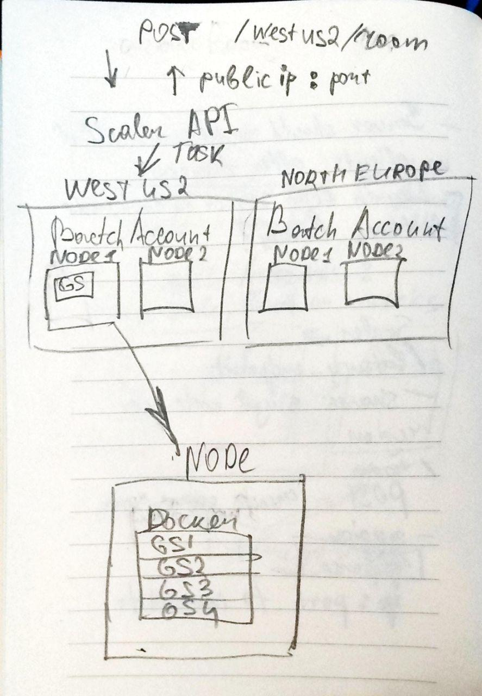

# gameserver-autoscaler

This is an API service which utilizes Azure Batch to orchestrate game server instances

## High-level overview of the architecture

- Scaler is an API which creates tasks for Batch Accounts
- Task == game room
- There's a one batch account per region
- Auto-scaling is managed by Azure Batch
- Easiest way to launch servers on nodes is Docker container
- In order to find the port for the server, there should be a simple script which probes available ports and then launches the server on the first available port
- Port for each server should be reported back to the Scaler, which can be done by writing port number to the file with taskId, which can be downloaded by Scaler

